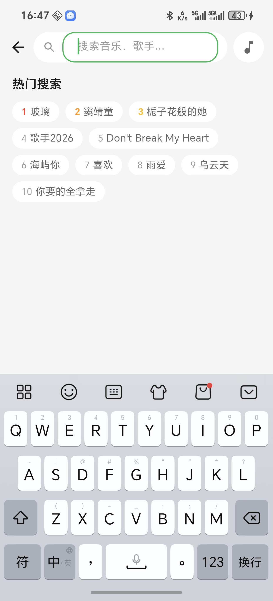
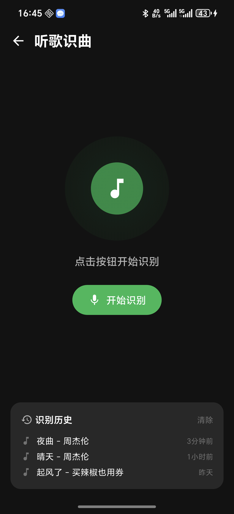

<p align="center">
  
</p>

<h1 align="center">薄荷音乐 · MintMusic</h1>

<p align="center">
  <strong>一款基于 Flutter 的安卓音乐播放器</strong><br>
  在线曲库 · 本地音乐 · 逐字歌词 · 音效增强 · 多音源自动切换
</p>

<p align="center">
  <a href="#功能特性">功能特性</a> ·
  <a href="#内置音源">内置音源</a> ·
  <a href="#插件系统">插件系统</a> ·
  <a href="#技术栈">技术栈</a> ·
  <a href="#快速开始">快速开始</a> ·
  <a href="#项目结构">项目结构</a> ·
  <a href="#免责声明">免责声明</a>
</p>

> ⚠️ 本项目仅供学习交流使用。所有在线音乐内容版权归原版权方所有，请支持正版音乐。

## 简介

薄荷音乐（MintMusic）是一个开源的安卓音乐播放器，UI 与交互参考 [CeruMusic](https://github.com/timeshiftsauce/CeruMusic) 的设计理念，使用 Flutter 从零实现。支持多平台在线音乐聚合搜索、本地音乐管理、Apple Music 风格逐字歌词（AMLL）、下载、音效增强与音源插件扩展。

## 截图预览

<p align="center">
  
  
  
  
  <br>
  <em>浅色模式</em>
</p>

<p align="center">
  
  
  
  
  <br>
  <em>深色模式</em>
</p>

## 功能特性

### 🎵 在线音乐
- 多音源聚合搜索：网易云 / QQ音乐 / 酷狗 / 酷我 / 咪咕
- 热门歌单、排行榜、歌单标签分类浏览
- 搜索联想与热门搜索词
- 跨音源自动换源：当前音源无法播放时自动切换其他音源继续播放
- 每音源独立音质设置（128K / 192K / 320K / FLAC 等，视音源支持而定）

### 📜 歌词
- 滚动歌词 + 逐字卡拉OK（YRC / LRCX 词时间轴解析）
- AMLL（Apple Music Like Lyrics）风格逐字歌词渲染
- 双语歌词（原文 + 翻译）

### 🎧 播放体验
- 迷你播放器 + 全屏播放页
- 播放模式：顺序 / 列表循环 / 单曲循环 / 随机
- 倍速播放、播放进度记忆、启动时自动续播
- 音频效果：均衡器（EQ）、低音增强、环绕音效、声道平衡
- 通知栏控制与后台播放

### 📂 本地与下载
- 本地音乐扫描与播放（MediaStore）
- 下载管理：文件名格式 / 标签写入 / 仅 WiFi 下载

### 🎨 外观
- 浅色 / 深色主题，可自定义主题色
- 全屏播放页多种背景模式与动态动画

### 🔌 插件扩展
- 支持导入洛雪（LX Music）风格的 JS 音源插件，扩展更多音源

## 内置音源

| 音源 | 说明 |
| --- | --- |
| 网易云音乐 | 内置 |
| QQ音乐 | 内置 |
| 酷狗音乐 | 内置 |
| 酷我音乐 | 内置 |
| 咪咕音乐 | 内置 |

> 内置音源通过公开接口实现，仅供学习研究。接口随时可能变更，如失效请以插件形式自行补充。

## 插件系统

应用支持洛雪（LX Music）风格的 JS 音源插件：

1. 打开 **设置 → 音源插件管理**
2. 导入 JS 插件文件（需遵循 LX 插件规范）
3. 在设置中为各音源选择音质，播放时自动使用

## 技术栈

- **框架**：Flutter / Dart（Material 3）
- **状态管理**：Riverpod（flutter_riverpod + riverpod_annotation 代码生成）
- **路由**：go_router
- **音频**：just_audio + audio_service + audio_session（后台播放 / 通知栏控制）
- **网络**：dio
- **序列化**：freezed + json_serializable
- **歌词引擎**：AMLL（@applemusic-like-lyrics，通过 amll_bridge 构建 WebView bundle）
- **插件引擎**：flutter_js（运行 LX 风格 JS 音源插件）
- **其他**：on_audio_query（本地音乐）、cached_network_image、permission_handler、record（识曲）等

## 快速开始

### 环境要求

- Flutter SDK 3.x（本项目使用 Dart SDK ^3.11.4）
- Android Studio / Android SDK

### 运行

```bash
# 安装依赖
flutter pub get

# 运行（需连接设备或模拟器）
flutter run

# 构建 Release APK
flutter build apk --release
```

### 测试

```bash
flutter test
```

> 说明：完整 App 的 UI 冒烟测试依赖真实音频服务平台通道，无法在纯 `flutter_test` 环境中运行，因此仓库内的 widget 测试为隔离的主题层冒烟测试，歌词解析等纯逻辑均有单元测试覆盖。

## 项目结构

```
lib/
├── app/                    # 应用入口、根组件、外壳（底部导航）
├── bootstrap/              # 启动引导
├── core/                   # 主题、路由、网络、存储、平台服务等
├── features/
│   ├── discover/           # 发现页（歌单、排行榜、标签）、识曲
│   ├── download/           # 下载中心
│   ├── library/            # 歌单库、最近播放
│   ├── local/              # 本地音乐
│   ├── my/                 # 我的
│   ├── player/             # 播放控制、播放器页面、歌词
│   ├── playlist/           # 歌单管理
│   ├── plugin/             # 音源插件系统（内置音源 + LX JS 插件）
│   ├── search/             # 搜索
│   └── settings/           # 设置
└── shared/                 # 通用组件与工具
```

## 免责声明

1. 本项目仅用于个人学习与技术研究，不提供任何形式的商业服务。
2. 所有在线音乐、歌词等内容版权归原版权方所有；内置音源与插件仅为接口适配，不存储、不缓存任何音频内容。
3. 请勿将本项目用于任何侵犯版权的用途，请支持正版音乐。
4. 使用本项目造成的任何问题由使用者自行承担。

## License

[MIT](LICENSE)
